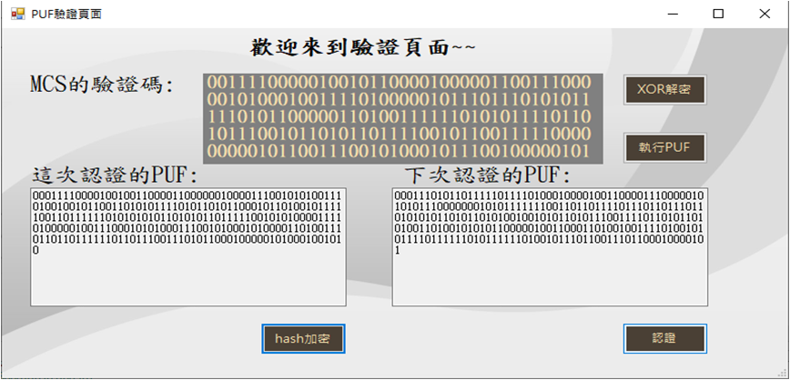
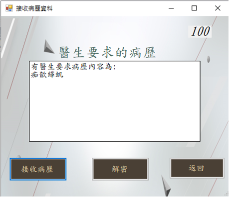
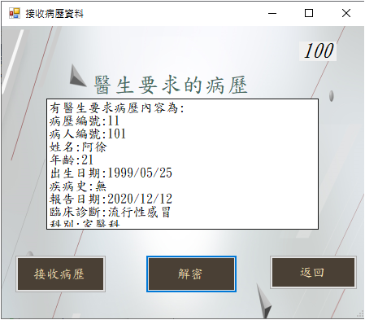
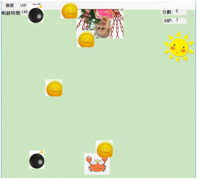
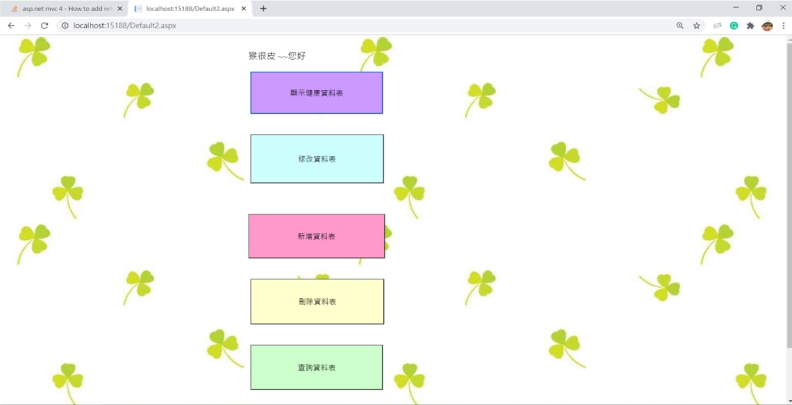
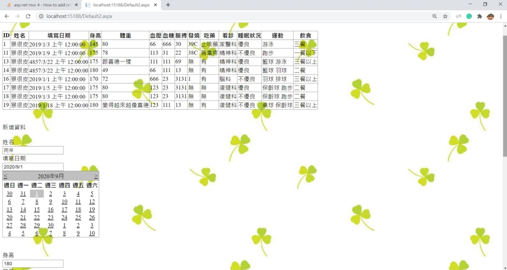
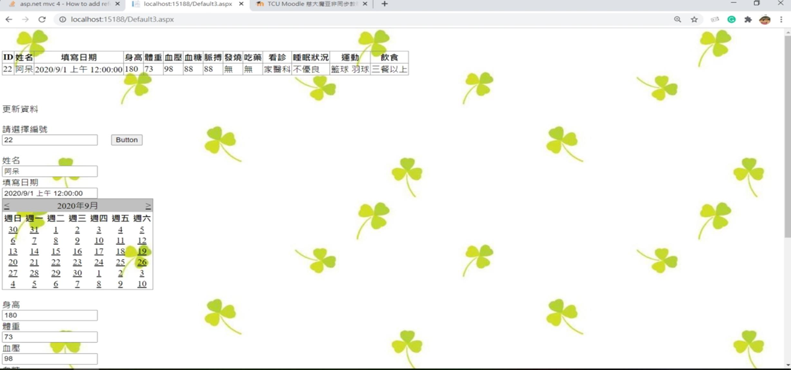

# 黃韋傑 
Birthday: 1999/01/20

Education:慈濟大學 / 醫學資訊學系 

Location: 台中市 

E-mail: dicejasd123465@gmail.com 

Mobile: 0988-561-184-Portfolio 

# 專業技能
1.	C/C++
2.	Java
3.	Python
4.	Asp.Net
5.	C#
6.	資料庫操作
7.	JavaScript
8.	HTML/CSS
9.	金鑰與身分驗證
10.	MVC基礎架構

# 工作經驗
* 叡揚資訊 
  * 職位:實習生
      * 公司內部系統
         * 優化公司舊有程式碼
         * 使用AJAX技術取得Json資料開發相關系統
      * 依照功能單建立新功能
         * 熟悉.NET MVC架構
         * 使用JavaScript或是SQL指令新贈系統功能
      * 單元測試
* 覺揚股份有限公司
  * 職位:實習生
    * FileMaker開發系統
      * 使用FileMaker完成主管交代系統功能
    * Line bot
      * 使用Google API與LINE Bot Designer取開發機器人系統
      * 使用Html、Css 與 JavaScript去架設系統網站
    
# 作品集
# 畢業專題
* 健康保健資訊資料庫之存取控制
  
* 醫生向Server取得資料庫

  
* 醫生使用密鑰解密資料  
  
# 視窗-螃蟹接硬幣小遊戲
* 遊戲關卡選擇

  
* 遊戲遊玩介面

  

# 網頁-健康紀錄系統
* 系統功能
  
* 新增病人資料
  
  
* 修改病人資料
  
