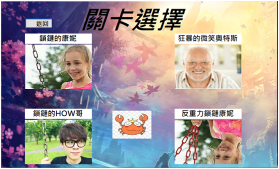

# 黃韋傑 
Birthday: 1999/01/20

Education:慈濟大學 / 醫學資訊研究所 

Location: 台中市 

E-mail: dicejasd123465@gmail.com 

Mobile: 0988-561-184-Portfolio 

# 專業技能
1.	C/C++
2.	Java
3.	Python
4.	Asp.Net
5.	C#
6.	資料庫操作
7.	JavaScript
8.	HTML/CSS
9.	金鑰與身分驗證
10.	MVC基礎架構

# 工作經驗
* 叡揚資訊 
  * 職位:實習生
      * 公司內部系統
         * 使用ASP.NET優化公司舊有程式碼
         * 使用AJAX技術取得Json資料開發相關系統
      * 依照功能單建立新功能
         * 熟悉.NET MVC架構
         * 使用JavaScript與HTML新增前端網站欄位
         * SQL指令將資料庫做新增或修改動作
      * 單元測試
* 覺揚股份有限公司
  * 職位:實習生
    * FileMaker開發系統
      * 使用FileMaker軟體完成主管交代系統功能
      * 新增、刪除、修改系統功能
    * Line bot
      * 使用Google API與LINE Bot Designer開發Line機器人系統
      * 使用Html、Css 與 JavaScript去架設系統網站

# 研討會(活動)證書
  * 2022 6th International Conference on Medical and Health Informatics
  
 * 巨匠工業局活動證明

  
  
# 作品集
 # 畢業專題
* 使用PUF技術於健康保健資訊資料庫之存取控制
  
* 醫生向Server取得資料庫

  
* 醫生使用密鑰解密資料  
  
  
  ⌞ 使用 C# 設計基本的系統介面。
  
  ⌞ 使用SQL資料庫儲存病人基本資料與帳號建置。
  
  ⌞ 使用C# 模擬出PUF晶片的特性，並應用於身分驗證存取。
  
  ⌞ 建立Server去驗證使用者的登入請求，並從資料庫存取資料。
  
  ⌞ 使用TCP/UDP達到病人端、醫師端、伺服器端之間的訊息與資料傳輸。
  
  ⌞ 專案使用Hash、XOR、對稱式加解密等技術對病歷做保護，並與使用者做身分驗證。
  
# 視窗-螃蟹接硬幣小遊戲

* 遊戲關卡選擇
(螃蟹接硬幣說明文件.pdf)
  
* 遊戲遊玩介面

  
  
    ⌞ 使用 C# 語法設計的小遊戲。
  
    ⌞ 包含C#視窗使用圖片、背景、音樂設定...等等。
  
    ⌞ 使用 C# 基本的Class等物件導向程式設定。
  
    ⌞ 使用C#去紀錄最高分讀寫檔案。
  
  
# 網頁-健康紀錄系統
* 系統功能
  
* 新增病人資料
  
  
* 修改病人資料
  

  ⌞ 使用ASP.Net 完成簡易的病人健康照護系統。
  
  ⌞ 其中使用SQL指令來將病人的基本資料存入資料庫中。
  
  ⌞ 使用Table將資料庫中的資訊顯示於網頁上。
  
  ⌞ 網頁可使用簡易的新增、查詢、修改、刪除等功能。
  
  
  
